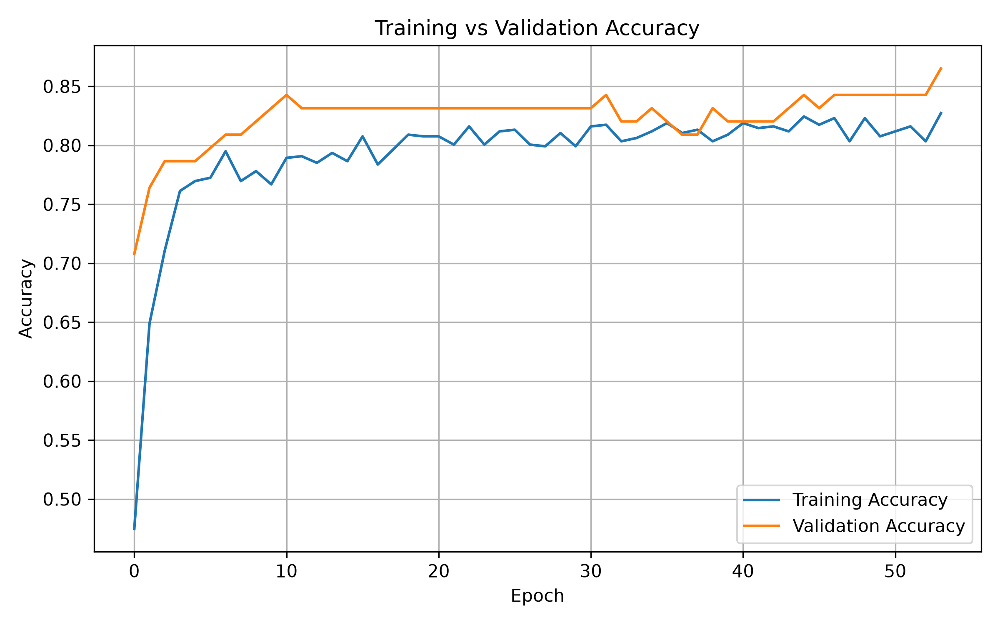
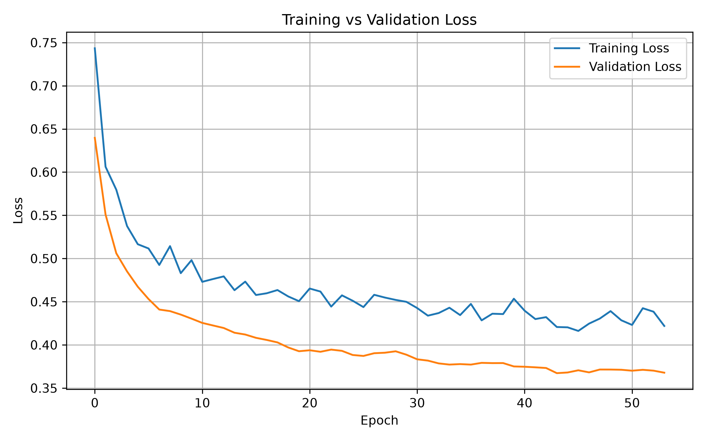
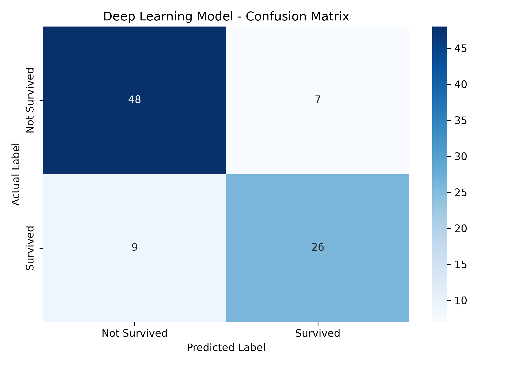

# Titanic_Internship
Titanic dataset data cleaning and preprocessing
# Titanic Internship

## Overview
This repository contains the work completed during the Titanic Internship project. The project focuses on data cleaning, exploratory data analysis, visualization, and unsupervised learning using Python.

## Week 2 – Exploratory Data Analysis

### Objective
The objective of Week 2 was to perform Exploratory Data Analysis (EDA) on the Titanic dataset and identify important patterns, relationships, and trends.

### Work Completed
- Cleaned and preprocessed the Titanic dataset.
- Handled missing values in important numerical columns.
- Performed statistical analysis of the dataset.
- Analysed passenger age and fare distributions.
- Studied survival patterns based on passenger class and sex.
- Created a correlation heatmap to understand relationships between numerical features.
- Created multiple visualizations to support the analysis.

### Week 2 Visualizations
- age_distribution.png
- fare_distribution.png
- correlation_heatmap.png
- survival_by_class.png
- survival_by_sex.png
- survival_count.png

## Week 3 – Unsupervised Learning and Clustering

### Objective
The objective of Week 3 was to apply unsupervised learning techniques to segment Titanic passengers into meaningful groups using K-Means clustering.

### Methodology
The cleaned Titanic dataset was used for clustering. Relevant numerical features including Age, Pclass, SibSp, Parch, and Fare were considered. Missing values were handled before applying the clustering algorithm.

K-Means clustering was applied with 4 clusters. The resulting clusters were analysed using their passenger counts and average feature values.

### Cluster Analysis

| Cluster | Passengers | Average Age | Average Pclass | Average SibSp | Average Parch | Average Fare |
|--------|------------|-------------|----------------|---------------|---------------|--------------|
| 0 | 520 | 27.32 | 2.79 | 0.23 | 0.09 | 11.96 |
| 1 | 32 | 27.97 | 1.00 | 0.72 | 1.28 | 227.08 |
| 2 | 233 | 40.32 | 1.22 | 0.36 | 0.21 | 51.26 |
| 3 | 106 | 15.72 | 2.73 | 2.26 | 1.93 | 30.81 |

### Cluster Insights
- *Cluster 0:* The largest group, containing 520 passengers, with a relatively low average fare of 11.96.
- *Cluster 1:* A small group of 32 passengers with the highest average fare of 227.08 and an average Pclass of 1.00.
- *Cluster 2:* Contains 233 passengers and has the highest average age of 40.32, with an average fare of 51.26.
- *Cluster 3:* Contains 106 passengers and represents the youngest group, with an average age of 15.72. It also has higher average SibSp and Parch values, indicating more passengers travelling with family members.

### Week 3 Visualizations
- cluster_age_fare.png
- cluster_size.png
- average_age_by_cluster.png
- average_fare_by_cluster.png

## Files

### Python Scripts
- data_cleaning.py
- week3_clustering.py

### Datasets

- cleaned_titanic.csv
- titanic_clustered.csv

### Results
- result.txt

## Technologies Used
- Python
- Pandas
- NumPy
- Matplotlib
- Seaborn
- Scikit-learn

## Conclusion
The project demonstrates the complete workflow of working with the Titanic dataset, from data cleaning and exploratory analysis to unsupervised learning and passenger segmentation using K-Means clustering.
# Titanic Survival Prediction - Week 4

## Project Overview

This project implements supervised machine learning models
to predict passenger survival using the Titanic dataset.

## Models Used

- Logistic Regression
- Random Forest Classifier

## Feature Engineering

- FamilySize
- IsAlone
- Title

## Evaluation

Logistic Regression:
- Accuracy: 84.36%
- Precision: 82.54%
- Recall: 75.36%
- F1-Score: 78.79%
- ROC-AUC: 0.8792

Random Forest:
- Accuracy: 81.01%
- Precision: 75.36%
- Recall: 75.36%
- F1-Score: 75.36%
- ROC-AUC: 0.8301

## Cross-Validation

Logistic Regression:
82.83% ± 0.78%

Random Forest:
81.37% ± 1.53%

## Final Model

Logistic Regression was selected based on its stronger
test performance, cross-validation results, stability,
and interpretability.
## Week 5 – Deep Learning

### Objective
Develop a Deep Learning model to predict Titanic passenger survival using a Neural Network.

### Dataset
The Titanic dataset was used for training and evaluating the model.

### Data Preprocessing
- Missing values were handled.
- Numerical features were scaled.
- Categorical features were encoded.
- Additional features such as FamilySize and IsAlone were used.
- Dataset was divided into training, validation, and testing sets.

### Neural Network Architecture

The model was built using TensorFlow/Keras.

- Input Layer: 14 features
- Dense Layer: 32 neurons
- Dropout Layer
- Dense Layer: 16 neurons
- Dropout Layer
- Output Layer: 1 neuron with binary classification

### Dataset Split

- Training samples: 712
- Validation samples: 89
- Testing samples: 90

### Model Evaluation

The model was evaluated using:
- Accuracy
- Loss
- Confusion Matrix

### Results

The test confusion matrix was:

[[48, 7],
 [9, 26]]

The model correctly classified 74 out of 90 test samples.

### Visualizations

#### Training vs Validation Accuracy

#### Training vs Validation Loss

#### Confusion Matrix

### Files

- week5_deep_learning.py – Deep Learning model code
- deep_learning_accuracy.png – Accuracy graph
- deep_learning_loss.png – Loss graph
- deep_learning_confusion_matrix.png – Confusion matrix
